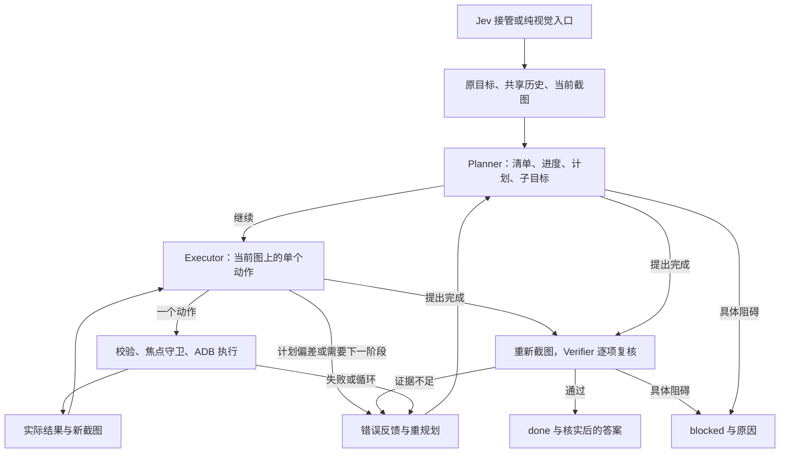

# 视觉智能体：实现与参考工程的对应关系

本次只读研究 `E:\python-3\automobile\mobilerun-main` 的任务状态、Manager、Executor、FastAgent、工具注册/执行、截图和推理链路，然后独立编写当前工程的实现与提示词。当前实现不导入参考项目，不依赖 LlamaIndex，不使用它的提示词、类或协议。图像处理新增 Pillow，其他能力复用当前工程的 ADB、输入法和 HTTP 客户端。

## 执行循环



Planner 在首次进入视觉模式时规划，之后只在计划偏差、阶段性发现需要新计划、执行错误、卡住/循环、意外焦点变化、过期动作或完成复核否决时重规划。新规划结束后再次截图，若窗口或横竖屏尺寸已变化则丢弃旧规划并重来；正常续执行使用上个动作后已经获取的最新观察，不再每步重复规划和额外截图。Executor 每轮检查结果并给出一个动作或控制提议；Verifier 只复核结果，不能操作设备。三个角色默认共用 `VISION_MODEL`，也可分别指定。独立复核指职责、提示词和请求独立，并不保证同一模型的错误互不相关。

### 保存计划与按需重规划

`progress.plan` 保存当前版本的阶段计划，`plan_cursor` 表示已经凭观察证据完成的阶段数，0 表示第一个阶段尚未完成。Executor 可以在一个阶段内执行多次操作，不会因命令成功或像素变化自动跳到下一阶段。它返回新增的 `completed_steps`，每项包含计划位置、观察证据和已发生的动作引用；程序要求位置连续、不重复、不越界，原始任务清单仍由程序保留。

Executor 的 `status` 为 `act`、`replan` 或 `complete`：act 只执行一个动作；replan 不操作手机，把具体偏差交给下轮 Planner；complete 不等于 DONE，必须先提供所有剩余计划阶段的证据，再用新图进入 Verifier。阶段计划用完但原任务还没做完时应 replan。读数等任务的候选答案写入 `progress.proposed_answer`，供 Verifier 核实；最终返回复核后的答案。

`completed_steps.index` 是从 1 开始的计划位置；动作顶层的 `index` 是当前 A11Y 控件编号，两者含义不同。下面表示“第一个计划阶段已观察完成，继续输入下一阶段的文本”：

```json
{"status":"act","summary":"已进入目标会话，尚未输入或发送",
 "completed_steps":[{"index":1,"evidence":"当前标题为目标联系人","steps":[2]}],
 "action":"TYPE_TEXT","index":12,"text":"你好","clear":true,
 "reason":"输入请求中的消息","expected_effect":"输入框出现你好"}
```

每次接受新计划会重置当前计划的 cursor 和阶段证据，增加 revision；全程动作和模型输出仍保存在轨迹中。Executor 更新累计摘要、当前子目标和预期结果，正常续执行期间无需 Planner 再描述一次相同进展。证据内容本身仍是模型判断，结构校验不能证明事实正确，因此最终必须逐项复核原任务要求。

离线轨迹中，正常连续 6 个动作对应 1 次 Planner、7 次 Executor（含最后的完成提议）、1 次 Verifier，共 9 次请求；原来每步规划的正常路径为 14 次。重试和重规划会增加调用，不能将该模拟计数换算成实机耗时或 token 节省比例。

| 参考工程机制 | 当前独立实现 | 运行效果 |
| --- | --- | --- |
| `agent/droid/state.py` 任务状态 | `Agent.state`、`vision.initial_progress()` | 原目标、清单、累计摘要、计划、子目标、成功条件、记忆、结果与错误共用一个状态 |
| Manager 观察、规划和终止 | `VisualAgent.decide()` 与 `PLANNER` | 根据实际页面和反馈决定继续、提出完成或说明阻碍 |
| Executor 将子目标转为操作 | `EXECUTOR`、`parse_execution()` 与 `parse_action()` | 检查结果、推进计划阶段、当前图定位，或请求重规划/完成复核 |
| ActionResult 和工具错误回传 | `Agent._act()` 的 history 与 `VisualAgent.feedback()` | 区分命令失败、画面变化和进展，失败也占预算并留记录 |
| 无状态上下文、累计记忆 | `VisualAgent.context()` | 全程动作摘要、近期详细结果、累计进度、证据记忆；不依赖服务端对话缓存 |
| 工具注册与能力约束 | `parse_action()` 与 `Device.act()` | 固定动作、参数和已安装包；禁止任意脚本 |
| screenshot provider 与坐标契约 | `visual_images.prepare()` | 完整图等比例缩放、坐标网格、原生/模型尺寸、横竖屏映射 |
| 推理纠正与重试 | `VisualAgent.request()` | 每阶段最多 3 次；区分格式错误、空正文、截断、服务拒绝，按原因调整思考或输出预算；纠正期间不操作设备 |
| 完成状态与结果 | `VERIFIER`、`parse_review()`、CLI answer | 新图逐项复核，证据不足继续修复，读取任务返回核实的答案 |
| 轨迹与用量 | `Agent.trace()`、`model_calls`、截图文件 | 各角色输出、失败响应、耗时、token、交接原因、前后页面与最终结果 |

对应范围是参考工程的 Android 视觉规划/执行链路。参考工程的云设备服务、iOS、MCP、技能系统和远程用户消息服务没有搬入这个 Android ADB 工程。

## A11Y 编号与坐标共同执行

进一步研究了参考工程的 `IndexedFormatter`、`UIState.get_element_coords()`、`actions.click/long_press/type_text` 以及工具能力约束。其编号操作从当前 UI 快照解析控件原生位置，再由设备驱动操作；截图坐标是另一条定位路径。这里独立实现相同机制，并复用 Jev 的 `action_space()`，没有另外建立一套编号。

视觉观察现在同时提供完整截图和尽力读取的 A11Y 表。模型请求中的 `elements` 包含当前整数编号、标签、角色、现值、允许操作和 0–1000 的 bounds。编号没有画在截图上；图上的网格数值仍是坐标。模型应结合表与截图选择目标，明确匹配时优先编号，缺少控件或 A11Y 不可用时选择坐标。

Mobilerun 的 `click(1)` 在本工程对应这样的结构化动作，并不执行 Python 字符串：

```json
{"status":"act","summary":"正在落实当前计划阶段","completed_steps":[],
 "action":"CLICK","index":1,"reason":"当前表中的目标控件","expected_effect":"出现预期页面"}
```

CLICK 和 LONG_PRESS 可以选择 index 或 point，不能同时给出。TYPE_TEXT 可以选择可编辑控件的 index，此时 current_text 从该控件快照自动获取；模型若另外提供了冲突现值会被拒绝。省略 index/point 的已聚焦输入仍要求 current_text。编号从 1 开始，不使用 -1 表示焦点输入。

编号在解析时绑定当前编号表指纹，原生 bounds 决定实际操作位置；它不是 Portal/Mobilerun 的原始编号，也不是跨页面稳定标识。执行编号动作前重新读取截图和 A11Y，检查窗口、屏幕尺寸及编号表是否一致。即使窗口没变，同一个编号换了目标、位置或现值，也丢弃动作并重新观察决策。未影响编号表的非交互文本变化或像素动画本身不会使编号失效。模型调用轨迹保存当前元素表，动作历史保存实际 index、标签、bounds 和绑定指纹。

无效、布尔、字符串、负数、不存在的编号和不匹配的输入目标均不执行。A11Y 是附加信息：优先查询现有 Portal，之后最多尝试一次 uiautomator 流式 dump；失败后在当前 Device 实例内停用后续探测并记录 a11y_error，保留截图与坐标操作，避免每轮重复慢重试。重新创建 Device（CLI 重跑任务）会重新尝试。编号动作的执行前复读有额外开销，Portal 可减少此开销。

## 交接上下文

每个角色拿到原始目标、切换原因、最后快路径页面、当前页面、剩余预算，以及：

- `attempted_actions`：全程最多 60 次尝试的摘要，含模式、动作、文本、错误、前后 activity、变化判定；早期输入不因只留最近几步而丢失。
- `recent_outcomes`：最近 6 次尝试的参数、前后页面摘要、预期效果和子目标；页面摘要含截图文件名，JSON 不嵌入图片。
- `progress`：完整要求清单、累计摘要、当前版本计划、plan_cursor、已完成阶段证据、子目标、预期结果、证据记忆、恢复反馈和候选答案。
- 图片：标注 previous/current 的前后两张图；第一次交接若快路径关闭截图，只有当前图。current 是当前现场。
- `installed_apps`：从手机查询的包标识，供 OPEN_APP 选择；查询失败为空，其他视觉导航仍可继续。
- `elements`：只提供当前快照的 A11Y 编号表；历史里出现的编号不能替代当前表。

Planner 从这些证据重建进度，不直接延续快模型最后一次选择。历史索引和旧截图坐标不是新图上的定位结果。首次规划生成覆盖原任务的清单，程序保存其 id、描述和顺序；之后 Planner 和 Verifier 只返回每项的 id、status、evidence、steps，描述由程序补回。即使模型附带不同措辞的描述，也不会覆盖原文或因此重试。更新必须覆盖所有已有 id，遗漏、替换、新增、重复编号仍会被拒绝；执行过程中的新计划放在 plan/subgoal，不修改任务清单。完成条件必须附观察证据。`steps` 只能引用已经尝试的动作，`[]` 表示当前图证据。代码校验引用存在和结构一致，事实真实性仍由模型判断。

## 视觉操作

| 操作 | 参数与行为 |
| --- | --- |
| CLICK | `index` 或 `point: [x,y]`，点击当前控件或图上位置 |
| CLICK_AREA | `box: [left,top,right,bottom]`，点击有效矩形中心 |
| LONG_PRESS | `index` 或 `point`，另有 duration_ms，默认 700ms，允许 100–5000ms |
| SWIPE | `start`、`end`、`duration_ms`，任意方向，默认 300ms，允许 100–5000ms |
| TYPE_TEXT | text、clear；可选 index 或 point；无 index 时须给 current_text；两者都省略表示已聚焦 |
| OPEN_APP | 从已安装包列表选择 package；不可启动时反馈错误 |
| BACK / HOME / ENTER | 返回、系统桌面、回车 |
| WAIT | duration，默认 0.5 秒，允许 0.1–10 秒 |

坐标为整数 0–1000，映射到原生 PNG 的 width-1/height-1，不受缩图大小影响。图片不裁剪。浮点/布尔/越界坐标、负时长、原地滑动、任意命令会被拒绝。Executor 没有 DONE。

输入复用 Portal 输入法、ADB Keyboard、ASCII 通道。追加通过“完整现值 + 新文本”走现有替换通道；无法看全现值时，模型应先选中/清空。非 ASCII 输入仍需支持的输入法。输入不等于提交，后续动作独立决定。

## 恢复、完成与预算

快路径在观察失败、缺乏点击/输入目标、模型/执行错误、连续 3 步无变化、4 次同控件 A/B 切换、BLOCKED 或持续 DONE 分歧时交接。交接后保持视觉模式，没有自动切回 Jev。

视觉每步把实际结果和新截图提供给 Executor。执行失败、连续 3 个非 WAIT 动作无变化、循环、Executor 提出的计划偏差和完成复核否决会反馈 Planner 并重新规划。单步像素变化不足不会强制重规划，Executor 仍可从截图/控件判断真实进展。连续 3 次恢复反馈后阻塞；可检测的页面变化清零恢复计数。窗口或编号过期会丢弃动作并刷新后重新规划，仍受共享请求上限约束。各角色无效输出最多尝试 3 次，持续失败停止任务。

全程共享 60 次设备动作尝试和 240 次决策模型调用尝试。规划、执行、复核、格式修正和失败响应均计入后者；HTTP 客户端内部对 429/503/529 的最多 3 次传输尝试属于一次逻辑调用。快路径文本助手单独统计，次数受动作上限约束。切换模式不重置预算。

变化判定使用未叠加网格的 32×32 灰度摘要，平均差异超过 `VISION_CHANGE_THRESHOLD` 才算变化；原始图哈希保留用于审计和严格 A/B 循环检测。画面变化用于卡住检测，不能宣告完成。

视觉完成有两个提议入口：Planner 从当前观察直接判定原要求已满足，或 Executor 提供当前计划所有剩余阶段的证据并提出 complete。两条路径都必须重新截图，由 Verifier 保留原清单、逐项确认正向证据，接受终止前再次检查焦点。前图保留最后一个动作的真实执行前截图，后图是复核时新采集的现场；没有执行过动作时可能没有前图。读取任务提出了答案时，Verifier 必须返回核实的答案。拒绝完成不产生虚假动作记录。

快路径保留原来的目标概率完成契约；正常 Jev 完成不强制视觉复核。若每个任务都需要视觉复核，使用纯视觉模式。

## 配置与运行

在 `.env` 设置支持图片及 JSON 输出的 OpenAI 兼容 Chat Completions 模型：

```dotenv
VISION_MODEL_API_KEY=your-key
VISION_MODEL_BASE_URL=https://openrouter.ai/api/v1
VISION_MODEL=your-image-capable-model
# 可选角色模型：空值复用 VISION_MODEL，端点/密钥共用
VISION_PLANNER_MODEL=
VISION_EXECUTOR_MODEL=
VISION_VERIFIER_MODEL=
# 默认：规划/复核低强度思考，执行关闭思考
VISION_PLANNER_REASONING=low
VISION_EXECUTOR_REASONING=none
VISION_VERIFIER_REASONING=low
VISION_MODEL_TIMEOUT=90
VISION_IMAGE_MAX_SIDE=1600
VISION_CHANGE_THRESHOLD=3
```

```powershell
python -m jev_mobile --task "你的任务" --vision-only
```

也可配置 `vision_only: true`。纯视觉不需要 Jev/文本助手密钥，不自动启动 Portal；观察时只读查询可用 A11Y，失败保留坐标路径。默认双级模式需要 Jev 密钥，视觉配置后自动允许接管。`--no-screenshots` 只控制快路径截图；视觉必须截图。

提示词集中在 `jev_mobile/visual_prompts.py`：COMMON、PLANNER、EXECUTOR、VERIFIER。流程/校验在 `vision.py`，图片契约在 `visual_images.py`，操作仍由 `device.py` 执行。

### 思考控制与输出失败处理

三个 `VISION_*_REASONING` 配置可以分别设置 `none`、`low`、`medium`、`high`、`max` 或 `default`。不配置时也采用上面的 low/none/low 默认值，不需要修改现有 `.env`。`default` 表示省略控制参数、沿用服务默认行为；拼写错误会在该角色发出请求前报错。

OpenRouter 端点使用 `reasoning` 参数；DeepSeek 官方端点或名称为 DeepSeek 的兼容模型使用 `thinking` 和 `reasoning_effort`（medium 映射为 high）。无法识别的服务/模型不发送这些专属参数。DeepSeek 名称的第三方网关如果不支持该协议，可设置 `default`，或更换支持控制参数的端点。是否实际关闭思考取决于模型和服务，程序记录请求参数与服务返回的思考 token，不把请求意图当作已生效的证明。

参数协议参考 [DeepSeek 思考模式](https://api-docs.deepseek.com/guides/thinking_mode/) 与 [OpenRouter Reasoning Tokens](https://openrouter.ai/docs/guides/best-practices/reasoning-tokens)。

每次角色请求初始 `max_tokens=4096`，包含服务计入该预算的思考和正文。处理顺序是：

1. 服务返回 `finish_reason=length` 时，整份响应作废，即使正文碰巧能解析成合法 JSON，也不执行。空正文单独记录为 `empty_content`。
2. 这两种失败如果同时报告了思考 token，且当前请求允许思考并有兼容控制参数，下次关闭思考后重试。若已要求关闭思考，或没有兼容控制方式，停止重试并说明原因，避免重复消耗。
3. 截断响应没有报告正数思考 token 时，最多把输出预算提高一次到 8192；再次截断就停止。缺少思考用量不能证明没有思考，因此这只是受限的恢复尝试。
4. 其他空正文、JSON/结构错误保留最多 3 次尝试上限；HTTP/请求错误单独分类。`content_filter` 或非空 `refusal` 立即停止。截断或空正文不会作为 assistant 消息回传，格式错误才回传有限长度的正文用于修正。

所有重试仍计入共享模型调用预算。`trace.json` 的 `model_calls` 保存 `requested_reasoning`、`request_options`、`reasoning_control`、`response_model`、`finish_reason`、`reasoning_tokens`、`content_chars`；失败还包含 `error_kind` 与 `retry_action`。缺少服务元数据时记录 null；不会保存 `reasoning_content` 思考正文。CLI 失败行显示结束原因、思考 token、输出上限和下一步重试策略。

思考控制处理推理与失败重试开销；按需重规划减少正常路径的模型请求和规划后刷新次数。角色上下文目前仍共用原来的完整结构，尚未做按角色裁剪。实际耗时与总输入 token 仍需用新运行的 trace 对比。

## 验证与限制

离线测试以脚本化模型和假设备覆盖交接、完整历史、图片/坐标、响应纠正、错误反馈、否决完成后修复、预算、证据清单、CLI 入口。验证的是协议和控制流程，不是真实模型识别准确率或手机任务成功率。

坐标动作仍可能在同一窗口布局变化或推理期间旋转后过期；编号动作增加了执行前复读，但读取和实际操作之间仍有短暂竞争窗口，也无法识别 A11Y 数据本身错误或遮挡未被树反映的情况。灰度变化可能漏掉小更新，或把动画当进展；共享预算限制持续循环。证据和记忆仍是模型判断，高价值操作需要独立验收。

本次没有运行手机真实任务，不能据离线测试声称与参考工程已有相同成功率。可用同一手机、同一模型、同一组任务，对比 trace 中的动作数、错误、完成证据和实际最终状态。
